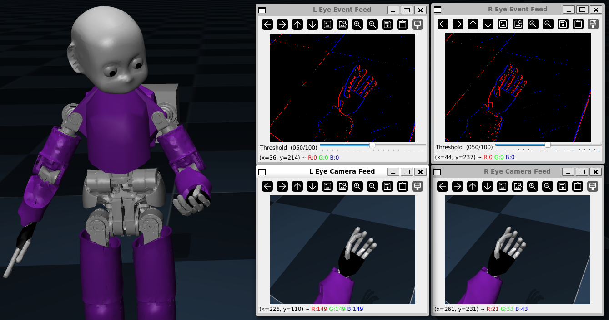
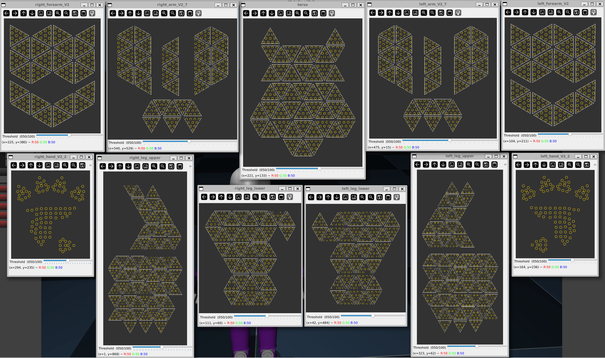
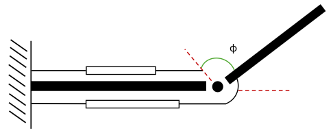
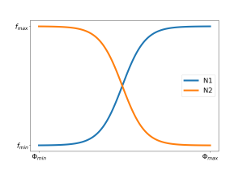
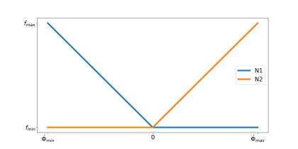
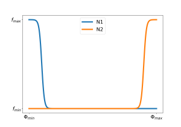
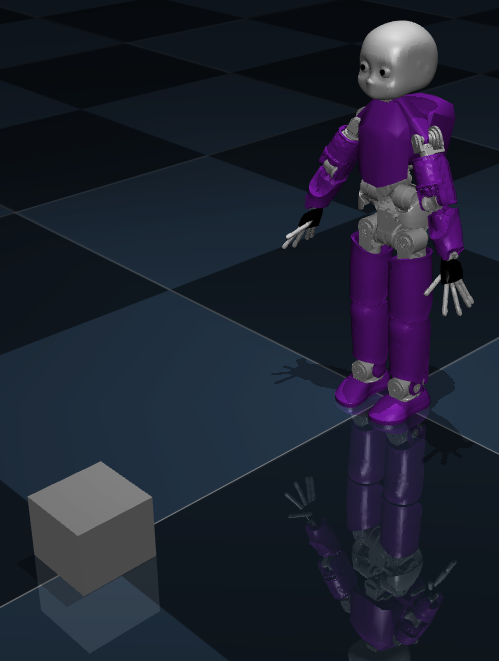

# Neuromorphic Body Schema

Repository to collect scripts for simulation and evaluation of body schema for a humanoid robotic platform.

## Cloning the Project Repository and Pulling LFS Files

To clone the `neuromorphic_body_schema` project repository and download the iCub mesh files from Git LFS (Large File Storage) - required for the project - use the following commands:

```
sudo apt update
sudo apt install git-lfs
git clone https://github.com/event-driven-robotics/neuromorphic_body_schema
cd neuromorphic_body_schema
git lfs pull
```

These commands will update your package list, install Git LFS, clone the project repository, and download any Git LFS files required for the project.

## Installing Required Packages

Required Python packages are listed in the `requirements.txt` file. To install them run the following command:
```
pip install -r requirements.txt
```
Install git-lfs with:
```
sudo apt install git-lfs
sudo apt install libosmesa6-dev libglfw3
```
## Event Simulation
The script `main.py` starts a simulated environment with the iCub humanoid robot, converting the simulated camera feed, joint states, and touch events into event streams. To run it go in the `neuromorphic_body_schema` and run 
```
python main.py
```

All events are organized following the AER protocoll. Events are sorted by time and are of the structure:
```
event = x, y, timestamp, polarity
``` 
Events are always calculated, the visualization is optional and is controlled at the top of the main via:
```
VISUALIZE_CAMERA_FEED = True
VISUALIZE_ED_CAMERA_FEED = True
VISUALIZE_SKIN = True
VISUALIZE_PROPRIOCEPTION_FEED = True
```

### Implementation of event-driven camera feed
The robot is equipped with two RGB cameras named ''r_eye_camera'' and ''l_eye_camera.'' At each simulation time step, the scene is rendered and the pixel values are passed to the CameraEventSimulator class which takes the RGB values and turns them into gray scale (and log space; optional: default on) and creates output events based on brightness changes. For each threshold crossing between to consequtive samples, events are spaced equally in time and increase and decrease of brightness change are indicated by polarity of 1, 0, respectively. Positive events are colored red, negative events are colored in blue.

Eyes are defined and cameras are included:
```
<body name="eyes_tilt_frame" pos="1.90392435799427e-10 0.104896999999692 0.0455907000018309" quat="0.707106781 0 0.707106781 0">
    <site name="eyes_tilt_site" type="sphere" rgba="0 0 0 1" size="0.01"/>
    <body name="r_eye_frame" pos="0.0 0.0 -0.034" quat="0.70710678 0 -0.70710678 0">
        <site name="r_eye_site" pos="0.0 0.0 0.01" type="sphere" rgba="0.9 0.9 0.9 1" size="0.02"/>
        <inertial pos="0 0 0" mass="0.01" diaginertia="0.001 0.001 0.001"/>
        <joint name="r_eye_pan_joint" pos="0 0 0" axis="0 -1 0" range="-0.5235987755982988 0.9599310885968813" damping="5.0"/>
        <joint name="r_eye_tilt_joint" pos="0 0 0" axis="-1 0 0" range="-0.5235987755982988 0.5235987755982988" damping="5.0"/>
        <site name="r_eye_pupil" pos="0.0 0.0 0.0275" type="cylinder" rgba="0 0 0 1" size="0.0075 0.003"/>
        <body name="r_eye_camera" pos="0.0 0.0 0.0" quat="-0.0233008 0.0078341 0.9825643 0.1842908">
            <camera name="r_eye_camera" fovy="42.4608673089277"/>
        </body>
    </body>
    <body name="l_eye_frame" pos="0.0 0.0 0.034" quat="0.70710678 0 -0.70710678 0">
        <site name="l_eye_site" pos="0.0 0.0 0.01" type="sphere" rgba="0.9 0.9 0.9 1" size="0.02"/>
        <inertial pos="0 0 0" mass="0.01" diaginertia="0.001 0.001 0.001"/>
        <joint name="l_eye_pan_joint" pos="0 0 0" axis="0 -1 0" range="-0.5235987755982988 0.9599310885968813" damping="5.0"/>
        <joint name="l_eye_tilt_joint" pos="0 0 0" axis="-1 0 0" range="-0.5235987755982988 0.5235987755982988" damping="5.0"/>
        <site name="l_eye_pupil" pos="0.0 0.0 0.0275" type="cylinder" rgba="0 0 0 1" size="0.0075 0.003"/>
        <body name="l_eye_camera" pos="0.0 0.0 0.0" quat="-0.0233008 0.0078341 0.9825643 0.1842908">
            <camera name="l_eye_camera" fovy="42.4608673089277"/>
        </body>
    </body>
</body>
```
 
Motion for both eyes' pan and tilt joints are coupled:
```
<tendon>
    <fixed name="eyes_pan_tendon">
        <joint coef="1.0" joint="r_eye_pan_joint"/>
        <joint coef="1.0" joint="l_eye_pan_joint"/>
    </fixed>
</tendon>

<tendon>
    <fixed name="eyes_tilt_tendon">
        <joint coef="1.0" joint="r_eye_tilt_joint"/>
        <joint coef="1.0" joint="l_eye_tilt_joint"/>
    </fixed>
</tendon>
```



### Implementation of event-driven skin
The skin is implemented by body part. Each body part has it's own output. The visualization shows each skin part indipendently. The encoding used is the same as for the vision sensor refelcting FA I response which only indicates change of sensor readings by events. 



### Implementation of event-driven proprioception
Event-driven proprioception is an event-driven readout of actuator values in real time from the MuJoCo simulator. 

In humans we receive proprioceptive inputs encoding for joint value, joint velocity, torque, and closeness to joint position limits. To maximise the informative content of the encoding, for each joint we split the output mimicking an agonistic-antagonistic muscular system. The total number of neurons as output will be therefore 4x2=8. The output is described in the following section.

The proprioceptive output can be scenatized in the following figure.



The joint in analysis is the elbow joint. The joint position value is represented by $\Phi$, in green. The limits of the joint are represented by the red dashed lines. The agonistic-antagonistic system is represented by the two empty bars. 

Joint position value is encoded in two opposite sigmoids, as shown below. Given a joint value, the output are two frequencies at which the two neurons will fire. The frequencies determine the number of events at each time-frame. The events of the two neurons are the output that will be shown in the simulation.    



Joint velocity value is encoded in two opposite linear functions, as shown below. Given a joint velocity value, the output are two frequencies at which the two neurons will fire.  The frequencies determine the number of events at each time-frame. We assume that when the robot is not moving the velocity is zero, and therefore there are no events. Moreover, we assume that the velocities are symmetric, positive and negative, according to the frame of reference of increasing/decreasing joint value. To not lose this information, one neuron will fire for positive velocities and another neuron for negative velocities. The events of the two neurons are the output that will be shown in the simulation.    




Joint loads follow the same logic as joint velocities, as shown below.


Joint position limits are encoded in two opposite steep sigmoids, as shown in the figure below. As the actuators reach each limit values, the function outputs a higher frequency, which determines the number of events at each time-frame. The events of the two neurons are the output that will be shown in the simulation.




To visualize the spiking output, set VISUALIZE_PROPRIOCEPTION_FEED = True. The output will show, from top to bottom:
```
joint position N1
joint position N2
joint velocity N1
joint velocity N2
joint load N1
joint load N2
joint limit N1
joint limit N2
```

To control which joints will be visualized, modify joint_dict_prop as desired. Insert in the dictionary the name of the joint according to the XML file (e.g. r_shoulder_roll), and set the maximum frequency parameters. The setup should look as follows:
```
joint_dict_prop = {
    'r_shoulder_roll': {
            'position_max_freq': 1000,  # Hz, maximum number of spikes per second 
            'velocity_max_freq': 1000,
            'load_max_freq': 1000,
            'limits_max_freq': 1000,
        },
    ...
}
```
Pre-set values are indicative and can be modified according to the desired needs of the simulation.


## Movement control
MuJoCo simulator's control of movement requires the distinction of two different objects: model and data. Model contains the general (usually immutable) information regarding the object to simulate, like its physics, its meshes etc.. Data contains the variables which strictly relate to the simulation at hand, like current positions, velocities etc.. 
Both are needed to advance the simulation through the command mujoco.mj_step(model, data).
However, data can be modified to move the robot.
To do so, use the function update_joint_positions(data, {joint: joint_position}) where joint_position are the new desired iCub positions. The code can be as follows: 
```
joint = 'r_shoulder_roll'
i=0

with mujoco.viewer.launch_passive(model, data) as viewer:

    sim_time = data.time

    while viewer.is_running():
        i+=1
        mujoco.mj_step(model, data)  # Step the simulation
        viewer.sync()

        joint_position = model.actuator(joint).ctrlrange[0]+0.001*i
        
        update_joint_positions(data, {joint: joint_position})

```
The robot will move all commanded joints towards the newly set joint value. This does not ensure, that the following simulation time step the robot has reached the target value yet. Depending on the distance from the actual to the target joint value and the inertia of the body part together with the kp value of the joint the robot might need multiple simulation time steps to achieve the target value (and possibly over shoot).   

## Changing and implementing of sensors
### Vision sensors
To implement further cameras add them to the target iCub body or the world (for an additional external camera). Then change create a new camera class object with the new cameras name.

### Touch sensors
The script include_skin_to_mujoco_model.py adds automatically the taxels from the robot's skin to the model saved in models/icub_v2_full_body.xml. To change the placement or implement further touch sensors the file in the models folder needs to be manipulated. Contact sensors are implemented as spheres (other shapes possible) of a user defined size (contact within that sphere are detected by the sensor) and can be visualized setting the RGB color to any desired value. Be aware that visualizing them slowes down the simulation significantly. Every sensor needs to be placed indepenedently and must be added to the according body. E.g.:
```
<body name="l_lower_leg" pos="0 0 -0.145825">
    <inertial pos="0.0009998 0.0034969 -0.088567" quat="0.037701 0.991172 0.120144 -0.041511" mass="1.4724" diaginertia="0.0046085 0.00423616 0.00148461" />
    <joint name="l_knee" pos="0 0 0" axis="0 -1 0" range="-2.16421 0.0698132"  />
    <geom pos="0.0437091 -0.0701 0.386638" quat="0.5 0.5 0.5 0.5" type="mesh" rgba="0.5 0.1 0.75 1" mesh="sim_sea_2-5_l_shank_prt-binary" contype="0" conaffinity="0"/>
        <site name="l_lower_leg_taxel_0" size="0.005" pos="0.06 0 0.01" rgba="0 1 0 0.0"/>
        .../...
        <site name="l_lower_leg_taxel_32" size="0.005" pos="0.0522 0 -0.15" rgba="0 1 0 0.0"/>
```
To visualize the sensors set rgba="0 1 0 0.0" to rgba="0 1 0 0.5". The first three are the RGB values and the last the transparency.

Finally, each sensor must be defined as sensor element at the bottom of the xml file
```
<sensor>
    <touch name="LEFT_LEG__LOWER_LEG__0__0" site="l_lower_leg_taxel_0" />
</sensor>
```

## Adding objects to the simulation
One can add objects to the simualtion as shown in the example with a box. The object musst be added to the xml file as part of the ''world.''
```
<worldbody
    <body name="icub" pos="0.0 0.0 0.63" mocap="true">
        ...
    </body>
    <!-- Here we inlcude a box as an example object -->
    <body name="box" pos="-1.0 0.0 0.1">
        <geom type="box" size="0.1 0.1 0.1" rgba="0.8 0.8 0.8 1" friction="1.0 0.05 0.01" solimp="0.95 0.95 0.01" solref="0.01 0.5" condim="4"/>
    </body>
</worldbody>
```




